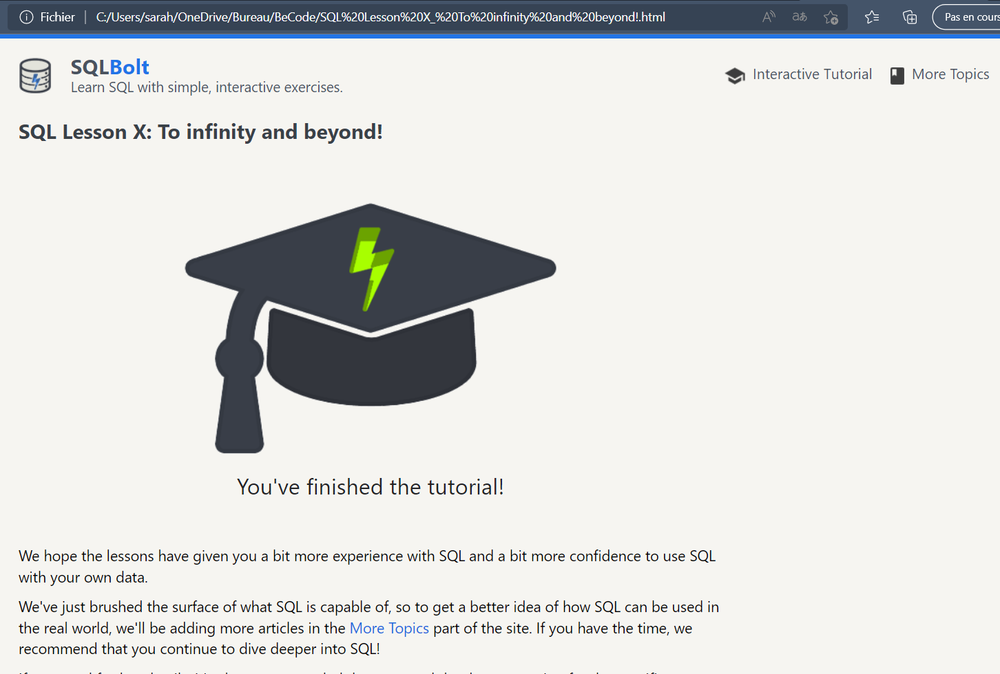

 
  
  

# SQL-learning 	:mag_right:

### Learning SQL as part of my training at BeCode as a junior web dev :computer:

## Objectifs de ce parcours SQL :floppy_disk

  1.  Comprendre ce qu'est une base de données et à quoi cela sert.
  2.  Maîtriser la syntaxe SQL.
  3.  Pouvoir concevoir et mettre en place une base de données dans un projet concret.
  

## Part 1 : training SQLBold :book:

 

 # Part 2 : Quiz SQL :white_check_mark:

 

 